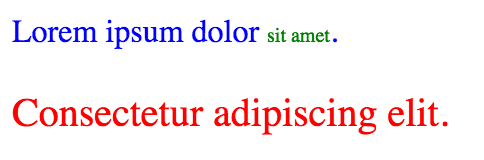

# Taming CSS
# Chapter 1: The Basics

## Declarations and Selectors

CSS syntax is very straightforward.  Let's look at an example:

```css
color: black;
```

This is a **declaration**.  It is made up of two parts: a **property** (`color`) and a **value** (`black`).  A colon goes between the property and the value, and a semi-colon ends the declaration.  Declarations are used to specify all sorts of styles.  This declaration, for example, sets the text color to black.

There are hundreds of various properties you can set.  They can specify everything from adding drop shadows to setting fonts to determining the position of an element on the page.  Don't let that overwhelm you, though, as you can get very far with just a small number of them, most of which are rather self-explanatory.  We will cover many of the most common ones in the next few chapters.

A declaration by itself isn't very useful (and in fact is not yet valid syntax).  We've set the text color to black, but what text color are we talking about?  To make it valid, need to specify which part of the document this style is intended for:

```css
body {
  color: black;
}
```

Now we've added a **selector**, `body`, and we've enclosed the declaration in braces to associate it with the selector.  This tells the browser to apply our declaration to the `<body>` tag.  Because all visible content is inside the `<body>`, this effectively gives the entire page black text.  We can also associate more declarations with the same selector.  Let's specify a white background:

```css
body {
  color: black;
  background: white;
}
```

Simple enough, right?  A selector and any number of declarations: together, these are called a **ruleset**.  Rulesets can be very long, including any number of declarations (though, typically not more than a handful), and they can be very short, even empty.  `body {}` is a valid ruleset.  Although it has no effect, it can be useful as a placeholder during development when you know you will need to use it soon.

The vast majority of your CSS will be in rulesets.  There are just a few other parts to CSS syntax, which we will get to later on.

### Linking CSS and HTML

Now that we know how to write a little bit of CSS, let's learn how to apply it to some HTML so we can see it in action.  There are three ways to do this:

First, **inline** styles may be used to apply style declarations directly to an HTML element using the `style` attribute.  For example: `<p style="color: red;">`.  Since this is done explicitly on an element, no selector is needed to target an element.  Typically, inline styles are not preferred, because they do not provide for code reuse.  They are also highly specific, meaning they are difficult to override.

Second, a `<style>` tag can be used to specify styles for the current document.  It should be placed inside of the `<head>`:

```html
<head>
  <style type="text/css">
    body {
      color: black;
      background white;
    }
  </style>
</head>
```

Third, a `<link>` tag can be used to link to an external CSS stylesheet.  This is generally the preferred way to use CSS.  It allows you to keep your CSS in a separate file from your HTML, and it allows you to reuse the same CSS on multiple different pages.  The `<link>` should be inside the document's `<head>`.

Let's make a starter webpage and link it to a stylesheet.  Create a `demo.html` file, and copy the following into it:

```html
<!doctype html>
<head>
  <link href="style.css" rel="stylesheet"/>
</head>
<body>
</body>
```

In the same directory, create a file named `style.css`.  Open `demo.html` in your browser.  Now, you can add CSS to your stylesheet and HTML to your webpage, and refresh your browser window to see the changes.

As you work through this book, add to these files to see the examples in action.  Play around with different values, selectors, and markup to see how it changes things.  You will learn a lot more by seeing things in action, and by seeing immediate feedback as your changes affect things.

## Basic Selectors

So far, we've seen only selector, `body`.  This is an example of a **type selector** (sometimes called a tag selector).  This selector specifies the HTML tag name it targets.  You can target any HTML element: the selector `p` targets all `<p>` on the page, `h1` targets all `<h1>`, etc.

We know there is only one `<body>` in a valid HTML document, so `body` only targets one element, but if we were to select another tag, such as the `<p>` tag, it would target all such tags on the page.

Another type of selector is the **class selector**.  Class selectors begin with a `.` followed by the name of the class they target.  For instance, `.navmenu` targets `<ul class="navmenu">`, or any other elements with that class.  The tag name is irrelevant: `.foo` targets `<div class="foo">` as well as `<li class="foo bar">`.  Note that targeted elements may also have additional classes.

**ID selectors** begin with a `#`.  `#sidebar` targets the element with that id, `<div id="sidebar">` for instance.  In HTML, ids must be unique, meaning only one element on the page may have a given id and each element may only have one id; if you need to put an identifier on multiple elements, use a class instead.

Let's try these out in your demo page.  Add this to your stylesheet:

```css
p {
  color: blue;
}

.tinygreen {
  color: green;
  font-size: 10px;
}

#bigred {
  color: red;
  font-size: 20px;
}
```

And add this inside the `<body>` tag of your html:

```html
<p>Lorem ipsum dolor <span class="tinygreen">sit amet</span>.</p>
<p id="bigred">Consectetur adipiscing elit.</p>
```

Save and oen up the page in your browser, and you should see the result:



You can do a lot with these three types of selectors, but sometimes you need to be more specific.  Selectors may be combined together to target more precisely.

If you concatenate two or more basic selectors together, you define a selector that targets elements meeting *all* of the specified criteria: `p.foo` targets `<p class="foo">` but not `<p>` or `<div class="foo">`.  `#navmenu.is-open` targets the `#navmenu`, but only if it also has the class `is-open` applied.  `.bar.baz` targets elements that have both the `bar` and `baz` classes.

<!--- WORKING HERE -->

Sometimes you want to apply the same set of styles to multiple elements that cannot be targeted with the same selector.

```css
input {
  color: gray;
  border: blue 1px solid;
}
textarea {
  color: gray;
  border: blue 1px solid;
}
```

This is silly; we're repeating ourself.  Thankfully, there's a better way:

```css
input,
textarea {
  color: gray;
  border: blue 1px solid;
}
```

Any number of selectors can be used in the same rule set, each separated by a comma.  This saves you from duplicating a lot of code.

### Another Example

Let's look at another example of a ruleset:

```css
.button {
  padding: 5px 15px;
  color: white;
  background: #336699;
  border-radius: 5px;
  text-decoration: none;
}
```

This uses a different kind of selector.  The `.` indicates that `button` is a class name rather than a tag name.  This selector targets all elements on the page that have the class `button`.  If we paired it with the HTML

```html
<a class="button" href="next.html">Next &raquo;</a>
```

we would get a button that looked like this:


Let's look at each of the attributes we set.

```css
padding: 5px 15px;
```
`padding` puts space between the border of the element and its contents.  In this case, we specified `5px`, or five pixels, for the top and bottom padding, and `15px`, or 15 pixels, for the right and left padding.

This is actually a shorthand notation, which `padding` and many other attributes support.  The equivalent full notation would be `5px 15px 5px 15px`.  This sets the four sides in clockwise order: top, right, bottom, left.  If you find that order tough to remember, just think "TRouBLe", which includes the first let of each direction in the correct order.

If the shorthand declaration stops before a side is given a value, that side takes its value from the opposite side: the left side value will match the right side; the bottom side will match the top.  If only one value is specified, that value is applied to all four sides.

Thus the following declarations are equivalent to one another:

```css
padding: 5px 15px;
padding: 5px 15px 5px;
padding: 5px 15px 5px 15px;
```

And the this set are equivalent to one another as well:

```css
padding: 5px;
padding: 5px 5px;
padding: 5px 5px 5px;
padding: 5px 5px 5px 5px;
```

Let's move on to the next declaration:

```css
  color: white;
```

We are already familiar with the `color` attribute.  This sets the color of the text to white.

<!-- Change to named color -->
```css
  background: #336699;
```

<!--- TODO -->

Let's look at the next declaration from our button:

```css
  border-radius: 5px;
```

The `border-radius` attribute is used to round the element's corners.  When left undefined, the default value is `0`, which means normal squared corners.  The higher the value, the more gradual the curve, up to half of the element's size.

```css
  text-decoration: none;
```

The `text-decoration` attribute is used to do things like underline or strike through the text.  It supports values like `underline`, `overline`, and `line-through`, though in this case, we've set it to `none`.  We do this because browsers typically underline links by default, but we don't want the underline to appear in our button.  Our `none` value overrides the browser's default value.

So now let's look at our complete ruleset again:

```css
.button {
  padding: 5px 15px;
  color: white;
  background: #336699;
  border-radius: 5px;
  text-decoration: none;
}
```

Now you can understand how these declarations work together to produce our blue button:


## Comments

Use `/*` and `*/` to open and close comments, respectively.  Anything between the the open and close is ignored by the browser.  This is useful to leave notes clarifying why some code is important or to temporarily disable a rule for testing.

```css
h1 {
  /* This is a comment.  It does not affect behavior of the CSS. */
  font-size: 18px;
}
```

## Formatting

The common convention is to indent each line inside braces.  White space does not matter.  You can put an entire ruleset, and even the entire css file in one line.

However, I strongly recommend you place each declaration on its own line.  This way, they are easier to parse visually as you maintain the code.  And because modern version control systems work on a line-by-line basis, they will be able to track changes to each declaration separately.  The semi-colon after the final declaration in a block is optional, but I recommend you add it.  Then you won't accidentally introduce invalid syntax should you come back later and add another declaration on the line below it.  It also means you won't have two lines changed in version control history when you only made a meaningful change to one.
