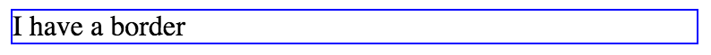
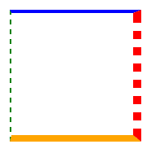
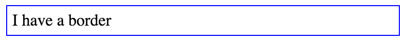

# Taming CSS
# Chapter 2: Styling Essentials

Now that you know the syntax of CSS and know how to write selectors, let's get a little more familiar with some styling.  We have already seen a few common properties.  Let's take a closer look at them, as well as a few other useful ones.

## Styling Text

Let's do a little more with the text on our page.  Place these styles in your stylesheet:

```css
body {
  color: slategray;
  font-family: "Helvetica", "Arial", sans-serif;
  font-size: 14px;
}
.incredible {
  font-weight: bold;
}
```

And in the body of your HTML:

```html
<p>My <span class="incredible">Incredible</span> Website</p>
```

In our browser, this gives us:


The `color` property we are familiar with.  Here we've set it to the color "slategray".

`font-family` specifies what typeface we want use.  You'll notice we specified three different values, separated by commas.  These specify fallback values, which is unique to this particular property.  Different users will have different fonts installed on their systems, so when the specified font is not available, the browser can look for through the list until it finds one that it can use.

The final value, `sans-serif`, is a special generic font.  You should always include a generic font at the end of your list.  If none of the specified fonts are available, the browser can load the default font of the appropriate type.  `serif`, `sans-serif`, and `monospace` are typically want you will want to use for your fallback, though `cursive` and `fantasy` are also valid values.

For a long time, fonts in CSS were limited to a short list fonts that are common to most systems; often they were paired up so a font common to Apple computers and one common to Windows computers were listed together.  This would ensure the user would have at least one of them.  In our example, these are Helvetica and Arial.  Other common sans-serif pairs included Impact and Charcoal, Geneva and Tahoma, or Geneva and Verdana.  Common serif pairs were Times and Times New Roman, Book Antiqua and Palatino Linotype, or Georgia (which is common to both operating systems).  These were called "web safe" fonts.  You could name a more exotic font, like "Helvetica Neue", but it would only work for users who happened to have that font installed.

With CSS3, we can now use **web fonts**, which allow use a font that is hosted online.  Modern browsers can download this font and use it on the page.  This has opened up our options dramatically.  We will look at web fonts later on, but in the meantime, you can look for font services such as Google Fonts that provide a large library of fonts to select from and simple code snippets to use them.

The next declaration in our example sets the `font-size`.  We specified our units in pixels, but there is actually an alarming number of other options available to us.  We will look at some of the common ones later in this chapter.

The final property in our example is `font-weight`.  Common values for this are `normal` and `bold`.  You may also specify values from `100` through `900`, in increments of 100.  `400` is the equivalent of `normal` and `700` is the equivalent of `bold`.  The number values are particularly useful in conjunction with web fonts.  If, for example, you provide an "Ultra Light" or "Black" variant from the font family, you can specify these with `200` or `900`, respectively.  If the exact weight you specify is not available, the browser will use the closest value it can.

There are also a `font-style` and `text-decoration` properties.  `font-style` accepts the values `normal` and `italic`.  `text-decoration` accepts `underline`, `overline`, `line-through`, and `none`.

## Backgrounds

So far, we've used the `background` property to set background colors, but it can also be used to apply background images or color gradients.

```css
.star-bg {
  background: url(star.png) lightgray center no-repeat;
}
```


This set a background image and a background color.  `center` positions the background image in the element and `no-repeat` means the image will not tile or repeat to fill the element.  We could also position with "top", "bottom", "left", "right", or any valid combination of them such as `bottom right` or `center left`.  Likewise, we can specify tiling with `repeat`.   `repeat-x` or `repeat-y` may be used to tile only horizontally or vertically, respectively.  You'll notice that the top and bottom of the image have been clipped off, because the element is not as tall as our background image; the background does not change the size of the element.  Here is an example with the image tiled:

```css
.star-bg-tiled {
  background: url(star.png) lightgray top left repeat;
}
```


`background` is an example of a **shorthand property**.  A shorthand property allows you to set the values several other properties at the same time.  `background` allows you to set values for `background-color`, `background-image`, `background-position`, `background-repeat` with one declaration.  Expressed the long way, the above ruleset is equivalent to this one:

```css
.star-bg-tiled {
  background-color: lightgray;
  background-image: url(background.png);
  background-position: top left;
  background-repeat: repeat;
}
```

This is a bit verbose.  You can see why we will generally favor a shorthand property when we can.  Not all of them are required in the shorthand.  We could just use `background: url(background.png) gray;`, if we wanted to use the default values for position and repeat ("top left" and "repeat").

Often, if a series of property names are hyphenated and begin with the same word, there is a shorthand property to succinctly define them together.  `font` is another shorthand property, which defines `font-style`, `font-variant`, `font-weight`, `font-size`, `line-height`, and `font-family`.  `border`, `padding`, and `margin` are some other common shorthand properties.  The order you specify values often matters, so as you learn shorthand properties, it is important to make note of the order.

## Borders

You can put a border around an element using `border`.  We saw this briefly in chapter one with the declaration `border: blue 1px solid`.  This is a shorthand property, setting `border-color`, `border-width`, and `border-style`.  Here is an element with this border:



Usually, you will want a `border-style` of `solid`, but other common values are `dotted`, `dashed`, and `none`.

Sometimes, you will want different border styles on different sides of an element.  You can specify one side at a time with `border-top`, `border-right`, `border-bottom`, and `border-left`.  These follow the same shorthand pattern of color, width, and style.

Alternatively, may use `border-color`, `border-width`, or `border-style` to specify values for each of the four sides independently:

```css
.crazy-border {
  border-color: blue red orange green;
  border-width: 2px 5px 4px 1px;
  border-style: solid dotted solid dashed;
}
```



Note the order of these values: top, right, bottom, left.  You will see this order for other attributes as well.  It is clockwise order, or if it is easier for you to remember, think "TRouBLe", which includes the first letter of each direction in the correct order.

Properties whose values follow this pattern all support some shorter notations.  If the declaration ends before one of the four sides is given a value, that side takes its value from the opposite side.  Specify only three values, and the left and right side will both use the second one.  Specify only two values, and the top and bottom will use the first one.  If you specify only one value, it will apply to all four sides.  Thus the following declarations are all equivalent to one another:

```css
border-width: 1px 2px;
border-width: 1px 2px 1px;
border-width: 1px 2px 1px 2px;
```

And the this set are equivalent to one another as well:

```css
border-width: 1px;
border-width: 1px 1px;
border-width: 1px 1px 1px;
border-width: 1px 1px 1px 1px;
```

There are also border properties `border-top-width`, `border-left-style`, `border-bottom-color`, etc.  Needless to say, there are a lot of ways to mix and match these if you want to build a complicated border, but often the regular `border` attribute is enough.

## Padding

You will notice in our examples for both backgrounds and borders, the text appears right up against the edge of our element.  You can correct this with `padding`.  This adds space inside the element between its border and its contents.

```css
.blue-border-padded {
  border: blue 1px solid;
  padding: 5px;
}
```



## Absolute vs. Relative Units

We have now seen the `px` unit a lot of these examples.  This is short for "pixel", and is an example of an absolute unit.

Specifying `px` ("pixels") does pretty much what it sounds like.  It tells the browser to make something display at a precise size.  Devices with high resolution screens, such as a Retina Display, will scale these up, so a CSS "pixel" may actually translate to more than one pixel on the screen, but as far as we are concerned, they are an unchanging value.

Up until now, I have used `px` with font sizing for clarity, but this is generally not recommended.  Some browsers allow users set a default font size ("Small", "Large", "Larger" etc).  If you use `px` sizing, these settings will not work.  Since this functionality is vital to some users, particularly those who are vision impaired, it is worth learning to specify fonts with relative units.

"Em"s are the most common relative unit.  Ems are a measure used in typography, referring to the height of the letters (originally, a capital M, which is where it gets its name).  So in CSS, one em (`1em`) means the height of the current element's font-size.  This mean that it's exact value varies depending on the font size of the element we are applying it to.

```css
.em-example {
  font-size: 16px;
  padding: 1em;
}
```

These will set both the font size and the padding equal to 16 pixels.  This is more interesting when we also set the font size using ems:

```css
.em-example-2 {
  font-size: 1em;
  padding: 1em;
}
```

Now both the font size and the padding are set to the same value... but we don't know exactly how big that value is.  The font-size is inherited from the parent element.  So, if the parent element's font is 16 pixels, then 1em equals 16 pixels.  2em equals 32px.  1.2em equals 19.2px.  0.8em equals 12.8px.

This gets interesting is when elements using ems are nested multiple levels deep:

```css
body {
  font-size: 16px;
}
ul {
  font-size: .8em;
}
```


Our text is shrinking!  What happened?  Remember, our `ul` selector targets all `<ul>` on the page, so it sets each list to a font 0.8 times that of its parent.  This means that our first list has a font size of 12.8px, but the next one down is 10.24px (12.8px * 0.8), and the third level is 8.192px, and so on.  Similarly, if we specified a size larger than 1em, our text would be continually growing instead.  Here's how we fix this:

```css
ul {
  font-size: .8em;
}
ul ul {
  font-size: 1em;
}
```

This second selector targets all unordered lists within an unordered list: all of them except the top level.  Nested lists now have a font size equal to their parents:


Much better.  But it should be clear now that ems can get away from us if we're not careful.  You are best off using ems

<!--- WORKING HERE -->

<!---
One other important unit is percent.  If a value is a horizontal value (such as `padding-left`) this means a certain perctage of the parent container's width.  If the value is a vertical value, it means a percentage of the parent container's height.  Finally, if you use percent to set a font size, it behaves much like ems; `100%` means equal to the parent container's font size.
-->

Pixels and Ems are two of the most common units in CSS, but there are many more.  See Appendix B for a comprehensive list.

### Colors

So far, we have been using named colors like "black", "slategray", and "orange".  There are about 150 named colors like these that are valid, but it's still fairly limiting.  Thankfully, there is a way we can specify any color we want:

```css
  background-color: #3366aa;
```

This is a **hex color**, also known as hex notation.  "Hex" is short for "hexadecimal", which is a base-16 number system.

Unlike our common decimal number system, which is base-10 and uses the ten digits 0 through 9, hexidecimal uses sixteen digits.  We represent these with 0 through 9 as well as A through F.  "A" represents the decimal value "10".  "B" represents "11", et. cetera up through "F" which represents "15".  Capitalization is ignored.

If you were to add one to `F`, you get `10`.  Instead of a tens column, as with decimal numbers, we have a sixteens column.  `11` means 1 sixteen plus 1.  `2A` means 2 sixteens (decimal 32) plus A (decimal 10).  Don't worry too much about the conversion, though.  Suffice it to say, in hex, letters have higher values than numbers; they are kind of like the face cards in a deck of cards.

You can easily get by with a general grasp of the concept.  Then you know that `B9` is larger than `9B`, and `A1` is much larger than `1A`.  Most often, you will be obtaining these values from a image editor or color picker, not writing them by hand off the top of your head.

So how does this get us a color?  A CSS hex color is actually three distinct hexidecimal numbers together, representing values for red, green, and blue.  In `#336699`, `33` is the amount of red, `66` is the amount of green, and `99` is the amount of blue.  Since blue is the largest value, so this color is primarily blue.  Because both digits in each value are equal, this number can be abbreviated as `#369`.

Colors you will common use include `#ffffff` (or `#fff`), which is pure white, and `#000000` (or `#000`), which is pure black.  (We use additive color, which means the higher the value, the more light we are adding).

## Links

When starting a new project, one of the first thing you'll generally want to style are links.  These require some special selectors:

```css
a:link {
  color: blue;
  text-decoration: underline;
}
a:visited {
  color: purple;
}
a:hover {
  color: darkblue;
}
a:active {
  color: red;
}
```

`a:link` refers to an `<a>` that has an href attribute.  `a:visited` refers to a link that the user has already been to before (i.e. its url is in the browser's history).  `a:hover` specifies styles to apply to the link when the user hovers their mouse cursor over it.  `a:active` styles the link after the user activates it, whether by clicking it with their mouse, tabbing to it with their keyboard and pressing enter, or tapping it on a touchscreen device.

Note the order of these selectors.  Because they all have the same specificity, the cascade causes a later declaration to override an earlier one.  If a visited link is active, we want the active color to appear, so we put that selector later, etc.  For years, I knew the order of these mattered, but never stopped to think about why.  There's no deep voodoo to it; it's just the cascade doing what it does.  If you don't want to stop and reason through the cascade every time, though, a helpful acronym to remember this order is "LoVe HAte".

The `:active` state is often overlooked.  We usually develop on fast computers with fast Internet connections.  When we click a link and the next page loads in an instant, we don't even notice that quick flicker of red text.  But on a slow connection--say, on a smartphone with a 3G connection--that red text means a lot.  It tells the user, for the two or three seconds after they tap a link but before anything else on the screen changes, that the page is loading, and they do not need to tap again.  Be sure to do something visually with the active state, even if it is very subtle.

The `a:link` is a bit of an odd relic from early HTML.  Originally, there were two uses for the `<a>` tag.  The first was a standard link, using the `href` attribute.  The second was a named key point in your document such as `<a name="section-two">`.  Then you could link directly to that point on the page using `<a href="#section-two">`.  This is where the name "anchor" comes from, as it was where one webpage was "anchored" to another via a hyperlink.

The second use is no longer practiced much, and is in fact deprecated in HTML5.  You can obtain the same behavior by using an id instead, and you can put it on any type of element you want, not just an `<a>` (`<span id="section-two">`).

In modern web applications, it is common to have anchors that activate functionality via JavaScript, and don't in fact link directly to another page.   This creates a bit of a problem, as we still want them to look and behave like a normal link.  To get this behavior, we often see `href="#"` or `href="javascript:void()"`, because there must be an `href` for the browser to treat it like a link.  Then, at least with `href="#"`, we have to be sure to call `event.preventDefault()` in the JavaScript handler to stop the browser from following the link.

Another, less common, option is to omit the `href` attribute and style `a` instead of `a:link`.  The link behavior we lose when we do this the underline and the cursor behavior when mousing over the link.  Thankfully, we can easily replicate both of these with CSS:

```css
a {
  text-decoration: underline;
  cursor: pointer;
}
```

I'm not saying you should always take this approach, but it is worth considering, especially in a web app where you find yourself using a lot of `<a>` tags.  (That said, always add an `href` when there is a url that makes sense; that way, a ctrl-click will still open the url in a new window.)

### Real-world Example

Let's put some of this together to style a button:

```css
.button {
  padding: 5px 15px;
  color: white;
  background: #336699;
  border-radius: 5px;
  text-decoration: none;
}
```

```html
<a class="button" href="next.html">Next &raquo;</a>
```

These result in:


Let's look at each of the properties we set.

```css
padding: 5px 15px;
```
`padding` puts space between the border of the element and its contents.  In this case, we specified `5px`, or five pixels, for the top and bottom padding, and `15px`, or 15 pixels, for the right and left padding.

This is actually a shorthand notation, which `padding` and many other properties support.  The equivalent full notation would be `5px 15px 5px 15px`.  This sets the four sides in clockwise order: top, right, bottom, left.  If you find that order tough to remember, just think "TRouBLe", which includes the first let of each direction in the correct order.

If the shorthand declaration stops before a side is given a value, that side takes its value from the opposite side: the left side value will match the right side; the bottom side will match the top.  If only one value is specified, that value is applied to all four sides.

Thus the following declarations are equivalent to one another:


Let's move on to the next declaration:

```css
  color: white;
```

We are already familiar with the `color` property.  This sets the color of the text to white.

<!-- Change to named color -->
```css
  background: #336699;
```

<!--- TODO -->

Let's look at the next declaration from our button:

```css
  border-radius: 5px;
```

The `border-radius` property is used to round the element's corners.  When left undefined, the default value is `0`, which means normal squared corners.  The higher the value, the more gradual the curve, up to half of the element's size.

```css
  text-decoration: none;
```

The `text-decoration` property is used to do things like underline or strike through the text.  It supports values like `underline`, `overline`, and `line-through`, though in this case, we've set it to `none`.  We do this because browsers typically underline links by default, but we don't want the underline to appear in our button.  Our `none` value overrides the browser's default value.

So now let's look at our complete ruleset again:

```css
.button {
  padding: 5px 15px;
  color: white;
  background: #336699;
  border-radius: 5px;
  text-decoration: none;
}
```

Now you can understand how these declarations work together to produce our blue button:


