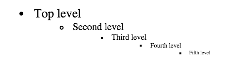
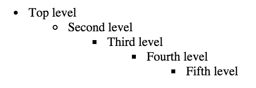

# Taming CSS
# Chapter 4: Data Types & Units

We've seen a number of various types of declaration values now: keywords like "top" and "left", colors like "slategray", and pixel values like "14px" fonts and "1px" borders.  These are all classified into various **data types**.  In this chapter, we will taking a closer look at these data types.  You should be familiar with them, especially some gotchas involved with a few of them that I will point out.

## Lengths

A **length** in CSS is used to denote a distance measurement.  It is a number followed by a length unit, such as `5px`.

We have now seen the `px` unit a lot of these examples.  This is short for "pixel".  Specifying `px` does pretty much what it sounds like: it tells the browser to make something display at a precise size.  On a stardard resolution display, this typically means one pixel on screen.  Devices with high resolution screens, such as a Retina Display, will scale these up, so a CSS "pixel" may actually translate to more than one pixel on the screen.  This is also true when printing a webpage.  Printers typically print at a much higher resolution, usually around 300 dpi, so one CSS "pixel" will generally equate to several dots of ink.  Whatever the case, the browser takes care of the scaling for us, so as far as we are concerned, pixels are an unchanging value.   Because of this, they are known as an **absolute** length unit.

Other absolute units are:

 * `mm`: one millimeter
 * `cm`: one centimeter, equal to 10mm
 * `in`: one inch, equal to 2.54cm and 96px
 * `pt`: one "point", which is a typographical term for 1/72 of an inch
 * `pc`: one "pica", another typographical term meaning 12 points

These units are generally less commonly used than `px`, but they can be useful at times.  They are all defined in terms of one another, so they are completely interchangable, as long as you feel like working out the math (96px = 25.4mm = 2.54cm = 1in = 72pt = 6pc).

Up until now, I have used `px` with `font-size` for simplicity, but it is generally not recommended to use absolute units for font size.  Browsers allow users set a default font size ("Small", "Large", "Larger" etc).  If you define absolute font sizes, you will be overriding this setting.  This is distinct from the "zoom" feature most browsers also provide, which will resize absolutely sized fonts, as well as everything else on the page.  Since a default font size is vital to some users, particularly those who are vision impaired, it is worth learning to specify fonts with **relative units**.

### Relative Units

"Em"s are the most common relative unit.  Ems are a measure used in typography, referring to the size of the letters, originally the width of a capital M (hence the name "em").  So in CSS, one em (written `1em`) means the font size of *the current element*.  Its exact value varies depending on the element we are applying it to.

```css
.em-example {
  font-size: 16px;
  padding: 1em;
}
```

These will set both the font size and the padding equal to 16 pixels.  Setting the padding to `2em` would make it equal to 32 pixels.  If another selector targets the element and sets a different font size, it will change the meaning of em, and thus the padding.

Using ems can be a very convenient when setting properties such as `padding`, `height`, `width`, or `border-radius`, because these will scale evenly with the element if it inherits different font sizes or the user changes their font settings.

As I mentioned above, we should use a relative unit for font size, let see what happens when we use ems:

```css
.em-example-2 {
  font-size: 1.2em;
  padding: 1.2em;
}
```

Now we've set the padding equal to 1.2 times the font size, and the font size equal to 1.2 times... itself?  Obviously, this doesn't make any sense.  When it comes to ems, `font-size` behaves a little differently: instead of ems being relative to the current element's font size, they are relative to the *inherited* font size.  So, if the parent element's font is 16 pixels, then a font-size of `1.2em` equals 19.2 pixels.  Then, we can calculate the current padding as 1.2 times that, giving us 23.04px.  Remember, for any property other than `font-size`, ems refer to the font-size of the current element, after the font size is calculated.

A simple formula to help calculate how many ems you need.  Divide your desired pixel size by the parent pixels size.  If you want 10px font and your element is inheriting 12px font, 10 &divide; 12 = 0.8333.  If you want 16px font and the parent font is 12px, 16 &divide; 12 = 1.3333.

When elements using ems are nested multiple levels deep, we can see some odd behavior:

```css
body {
  font-size: 16px;
}
ul {
  font-size: .8em;
}
```



Our text is shrinking!  What happened?  Remember, our `ul` selector targets all `<ul>` on the page, so it sets each list to a font 0.8 times that of its parent.  This means that our first list has a font size of 12.8px, but the next one down is 10.24px (12.8px * 0.8), and the third level is 8.192px, and so on.  Similarly, if we specified a size larger than 1em, our text would be continually growing instead.  Here's how we fix this:

```css
ul {
  font-size: .8em;
}
ul ul {
  font-size: 1em;
}
```

This second selector targets all unordered lists within an unordered list: all of them except the top level.  Nested lists now have a font size equal to their parents:



Much better, though this feels a little hacky.  It should be clear now that ems can get away from us if we're not careful.  Thankfully, there is a better option: rems.

"Rem" is short for "root em".  Instead of being relative to the current element, rems are relative to the root element, the `<html>` tag.

```css
html {
  /*
    use the browser default size of 16px
    (unless user setting changes that)
  */
  font-size: 1em;
}
.parent {
  font-size: .75rem;
}
.parent .child {
  font-size: 1.2rem;
}
```

In this example, our `.parent` element has a font size equal to 12px (16px * .75), and our `.child` has a font size of 19.2px (16px * 1.2); the child's font size is no longer related to the parent's, but rather to the document root.  This still gives us the benefit of being a relative unit.  If the user bumps up their default font size, our font will increase with it.

Another nice benefit of using relative font sizes is that we can also change fonts globally on the page ourselves.  If we changed the first ruleset to set the root element's font to `1.1em`, it would change the calculation of all relative fonts on the page.  Our `.parent` would now be equal to 13.2px and our `.child` would be equal to 21.12px.  If your client decides they fonts on the site you built are too small, you can change them globally by only touching one line of code.  Again, these would all still remain subject to the user's font settings.

As you can see, rems simplify a lot of the complexities involved with ems.  But that doesn't mean you should abandon ems altogether.  Instead, use ems when you want to be relative to the current element's font (for `padding` and `border-radius`), and rems for `font-size`.

It can be very easy to get bogged down obsessing over exact pixel font sizes.  You will drive yourself mad dividing and multiplying em values as you go.  Instead, I challenge you to try to forget about the pixel equivalents.  Embrace ems (or rems).  It can take some practice, especially if you are already accustomed to using pixels.  To help you get familiar with them, I will be using ems and rems throughout the rest of this book, especially with fonts.

There is still a place for absolute length units, so I'm not saying abondon them altogether.  I still use pixels for borders, particularly when I want a nice fine line.

Two other font-relative units are `ex` and `ch`.  Ex refers to the "x-height", which is generally the height of a lowercase "x" (typically equal to 0.5em).  Ch refers to the width of the "0" (zero) character of the font.  These are rarely used.

There also units for defining lengths relative to the browser's viewport:

 * `vh`: 1/100th of the viewport height
 * `vw`: 1/100th of the viewport width
 * `vmin`: 1/100th of the smaller dimension, height or width
 * `vmax`: 1/100th of the larger dimension, height or width

These are only recently becoming common.  They are a newer feature to most browsers, so there are a few odd bugs when you use them in particular situations, especially vmin and vmax.

## Percent

**Percentages** are another data type.  It are very similar to a length, in that it is a number followed by a unit (e.g. `50%`), and it behaves very much like a relative length unit.  Strictly speaking, though, it is not considered one, as there are some places where lengths are a legal value but percentages are not (such as `border-width`).

Percent refers to the size of the containing block.  If the property it specifies is horizontal in nature, like `padding-left`, it refers to the container's width; if vertical in nature, like `padding-top`, it refers to the container's height.  Percent are particularly useful for sizing blocks according to their parent container:

```css
.container {
    width: 200px;
    height: 200px;
    background-color: lightgray;
}
.child {
    width: 50%;
    height: 50%;
    background-color: darkblue;
}
```
```html
<div class="container">
  <div class="child"></div>
</div>
```

These yield:


Once again, `font-size` is an exception to the rule.  When applied to font size, percent behave just like ems.  `100%` equals the inherited font size, or `1em`; `80%` equals `0.8em`, etc.

One practice that has been common for a number of years is to add `body { font-size: 62.5%; }` near the beginning of a stylesheet.  This scales the root font down to 10px (with default user settings), and makes the math simpler for working with relative font sizes: `1.2rem` equals `12px`, etc.  You can do this if you find it helpful.  Ideally, though, you should set your root font to the primary font size you want on your page, so you don't have to override it all over the place.  Again, I encourage you to try to ignore the exact pixels values, and think in more relative terms.

## Unitless Numbers

Some properties allow for **unitless** values.  We saw this with `font-weight: 400`.  `line-height` and `z-index` also accept unitless values.  You may also use the unitless value `0` anywhere a unit is typically required, because in this case the unit does not matter.

`line-height` is peculiar in that it accepts both units and unitless values.  The preferred method is to use unitless numbers, because they are inherited differently.  When units are specified, their value is calculated, and that calculated value is passed down to any inheriting children.  For instance, `line-height: 1.2em` may be calculated as a 19.2px line height based on a 16px font size.  Then, a child element with a font size set to 24px will have lines of text overlapping one another, because their baselines are only 19.2px apart.  If, instead of ems, we specified `line-height: 1.2`, this child element's line height would be re-calculated based on the larger font size, and the line height would scale as we probably expect.

## URLs

**URLs** are used to refer to another resource outside the stylesheet.  These are most commonly used for setting background images:

```css
.my-background {
  background-image: url(background.jpg);
}
```

The url may be absolute or relative.  If a relative url is specified, it refers to a path *relative to the stylesheet*, not relative to the page.  The url inside the parentheses may optionally be quoted with single- or double-quotes.

These may also be used with the `cursor` property to specify a custom cursor icon or the `list-style` property to use a custom bullet point in a list.  They are also used to specify web fonts, which we will cover in a later chapter.

## Keywords

Some properties accept various keywords.  A keyword is a special value, often particular to a given property.  It is not enclosed in quotation marks.  Some examples are `font-weight: bold`, `text-decoration: underline`, or `color: black`.

## Colors

So far, we have been using named colors with keywords like `blue`, `slategray`, and `orange`.  There are about 150 named colors like these that are valid, but it's still fairly limiting.  Thankfully, there are a number of ways we can specify any color we want.

### Hex Colors

```css
background-color: #3366aa;
```

This is a **hex color**, also known as hex notation.  "Hex" is short for "hexadecimal", which is a base-16 number system.

Unlike our common decimal number system, which is base-10 and uses the ten digits 0 through 9, hexidecimal uses sixteen digits.  We represent these with 0 through 9 as well as A through F.  "A" represents the decimal value "10".  "B" represents "11", et. cetera up through "F" which represents "15".  Capitalization is ignored.

If you were to add one to `F`, you get `10`.  Instead of a tens column, as with decimal numbers, we have a sixteens column.  `11` means 1 sixteen plus 1.  `2a` means 2 sixteens (decimal 32) plus A (decimal 10).  Don't worry too much about the conversion, though.  Suffice it to say, in hex, letters have higher values than numbers; they are kind of like the face cards in a deck of cards.

You can easily get by with a general grasp of the concept.  Then you know that `b9` is larger than `9b`, and `a1` is much larger than `1a`.  Most often, you will be obtaining these values from a image editor or color picker, not writing them by hand off the top of your head.

So how does this get us a color?  A CSS hex color is actually three distinct hexidecimal numbers together, representing values for red, green, and blue.  In `#336699`, `33` is the amount of red, `66` is the amount of green, and `99` is the amount of blue.  In this example, blue is the largest value, so this color is primarily blue.  Because both digits in each value are equal, this number can be abbreviated as `#369`.

CSS colors are *additive*, which means the higher the value, the more light we are adding.  This is in contrast to *subtractive* color like paint&mdash;the more dye you add, the darker paint gets.  Because of additive color, `#ffffff` (or `#fff`) is pure white, and `#000000` (or `#000`) is pure black.  Likewise, any other color where the red, green, and blue values are the same or nearly the same will appear as a shade of gray.

### RGB & RGBA

Hex colors are nice because they are very succinct; one short value tells you everything you need to know to identify a precise color.  The downside is that they are a bit cryptic.  You may find it easier to work instead with **RGB** colors, which look like this:

```css
color: rgb(255, 255, 255);
```

Instead of three hexidecimal numbers, we use three numbers in our familiar decimal system, each representing red, green, and blue.  Each number must be between 0 and 255 (Hexidecimal "ff" equals decimal 255).  In this example, we have defined pure white.  Another benefit of using RGB colors is we can add transparency without much trouble, by changing to "rgba" and adding an **alpha** value:

```css
color: rgba(255, 255, 255, 0.5);
```

The alpha value must be between 0 and 1.  The lower it is, the more transparent the resulting color, from 1 (completely opaque) to 0 (completely transparent).

### HSL & HSLA

Another way we can define colors is with **HSL** values.  This stands for "Hue, Saturation, Lightness", which are the three values we specify to define a color.  The first value, hue, is a number between 0 and 359.  This represents the 360 degrees of the color circle, transitioning evenly through red (0), yellow (60), green (120), cyan (180), blue (240), magenta (300), and back to red.  The second value, saturation, is a percentage representing the insensity of the color.  100% makes the color very vivid; 0% means no color is present, resulting in a shade of gray.  The third value, lightness, is a percentage representing how light (or dark) the color is.  A lightness of 50% provides for the most vivid colors;  setting it higher makes the color lighter, with 100% resulting in pure white; setting it low makes the color darker, with 0% resulting in black.  Here is an example of an HSL color:

```css
color: hsl(200, 70%, 75%);
```

This defines a pale, sky blue.  We can see the hue is somewhere between cyan and blue, the saturation is rather high, but the brightness is also high which washes it out a bit.

It takes a little getting used to, but this method can be a lot easier to work with at a glance, especially for predicting the difference between two colors before seeing them rendered in the browser.  It especially helpful when you want to create several shades of the same color, because you can set the hue the same and just adjust the other two values.

The relationship between hue, saturation, and lightness is quite different than RGB colors.  If saturation is 0%, the hue is irrelevant.  `hsl(0, 0%, 50%)` and `hsl(180, 0%, 50%)` are both the exact same medium gray.  Similarly, if lightness is 0% or 100%, the saturation is irrelevant.  When the lightness is closer to these values, say 10% or 90%, the saturation has some effect, but less so than with a lightness of 50%.

We can also use HSLA color, adding an alpha channel that behaves the same as the RGBA alpha channel:

```css
/* this color is now 50% transparent */
color: hsla(200, 70%, 75%, 0.5);
```

Here are several named CSS colors and their equivalents in hex, rgb, and hsl:

Name     | Hex     | RGB                | HSL
---------|---------|--------------------|--------------------
blue     | #0000ff | rgb(0, 0, 255)     | hsl(240, 100%, 50%)
lavender | #e6e6fa | rgb(230, 230, 250) | hsl(240, 67%, 94%)
coral    | #ff7f50 | rgb(255, 127, 80)  | hsl(16, 100%, 66%)
gold     | #ffd700 | rgb(255, 215, 0)   | hsl(51, 100%, 50%)
green    | #008000 | rgb(0, 128, 0)     | hsl(120, 100%, 25%)
tan      | #d2b48c | rgb(210, 180, 140) | hsl(34, 44%, 69%)

If this is a bit confusing, that is okay.  It will come with practice.  When I start coding in colors on a new design, I usually just take a stab at it, and then adjust it using the graphical color picker in Photoshop or my browser developer tools.  You are trying these out in your browser, right?  Copy these into your test page to make it easier, then experiment with changing the color values and adding alpha values:

```html
<div class="box color-one"></div>
<div class="box color-two"></div>
<div class="box color-three"></div>
```

```
.box {
  height: 10em;
  width: 10em;
}
.color-one {
  background: #fa6a64;
}
.color-two {
  background: rgb(122, 78, 72);
}
.color-three {
  background: hsl(159, 26%, 70%);
}
```

There are two final special keyword colors: `transparent` and `currentColor`.  Transparent sets a fully transparent color.  It is useful for overriding solid colors.  The `currentColor` keyword can be used to apply an element's calculated (or inherited) `color` value to other properies.  For instance, `border: 1px solid currentColor` will give an element a border that matches its text color.
