# Taming CSS
# Chapter 5: Document Flow

CSS has two primary responsibilities on a web page: styling and layout.  Styling pertains to the look and feel of the individual elements on the screen.  We have looked at a number of things like font size, backgrounds, and colors which are all about styling.  In this chapter, we will begin to turn our attention to layout.  Layout pertains to the position of elements on the page and in relation to one another.

Think about the last webpage you visited.  Perhaps it had a navigational bar across the top of the screen, with links or even dropdown menus arranged horizontally.  Or maybe it had a menu down the side, with links stacked one atop another.  On some sites, the main navigation remains fixed on the screen as you scroll the page, on others it scrolls normally.  The page likely had a footer at the bottom, below both the main content and any sidebars; on some pages, the sidebar may have been longer than the content, but on others the content may have been longer than the sidebar.  Either way, the footer is below them both.  There are also less obvious elements in the design: modal dialog boxes, expanding search boxes, promotional sections that appear side by side or in a grid.  All of these things are part of the layout.

Layout is one of your first major design concerns when designing a new site.  It can also become very complex, depending on what you wish to do.  Most questions I get about CSS concern troubles with layout.  There are countless ways to position and size elements on the page, and dozens of ways they can interact with each other.  Needless to say, it is essential to understand the parts of CSS that have to do with layout, and your knowledge of them needs to be thorough enough that you can understand and predict how they will interact with one another when mixed and matched in different ways.

Some of the main tools we use to layout pages are positioning, floats, and sizing.  But before we dive too deep into to those, we need to understand how the page behaves by default.  We can not effectively change things from their default state if we don't understand what the default state is and how it behaves.  When we change an element from its default state, we need to also understand how the elements around it will behave.  This default state is called the **normal document flow**.

The browser displays content in the order it appears in the HTML markup, starting at the top of the page, and works downward as far as it needs to until all content is displayed.  Text will fill the full width of its container, line wrapping as necessary when it reaches the end.  It looks like this:

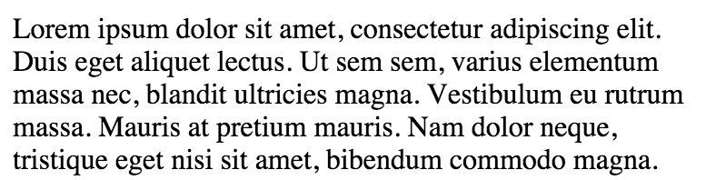

HTML does something interesting with white space: it collapses it.  White space is not strictly followed, but it is not ignored completely either.  Any amount of consecutive white space&mdash;tabs, line breaks, spaces&mdash;is rendered as a single space.  The HTML from the image above could be written in one long line, or it could be spread out over any number of lines, each indented any number of ways.  We tend to take this for granted, but it comes into play from time to time when we may not expect it.

Now observe what happens when we insert an `` in the middle of the text:

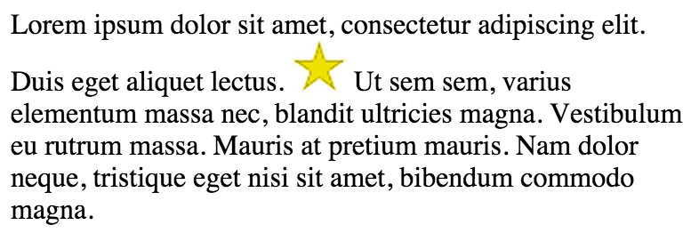

The browser makes a few changes here to accomodate the image.  First, a it carves out a gap horizontally between the text where the image appears; the text prior to the image stops ("...lectus. "), the image is rendered, and then the following text resumes (" Ut sem...").  Again, if there is any white space between the text and the image, a space is collapsed and retained as a single space character.

The second change the browser makes is a shift in the vertical spacing of the text, but only for the line where the image appears.  We can observe a similar behavior if we wrap part of the text in a `<span>` that sets a larger font size:

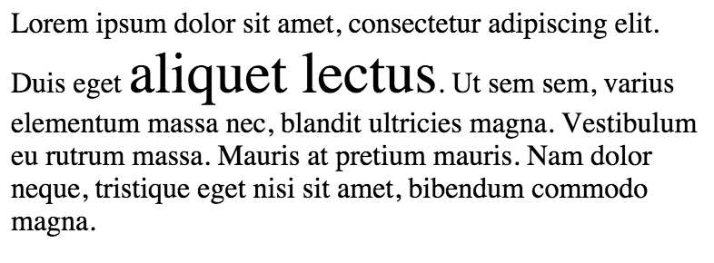

This also shifted the vertical spacing of the text, and again, only for the affected line.  But if you notice, it did so a little differently.  With the image, it only added space above the line of text.  In this case, it added space above, but also a little bit below to accomodate the descenders (i.e. the tail of the "q").

The behavior is caused by the `vertical-align` property.  The default vertical alignment is `baseline`.  The baseline is the bottom edge of the text, not including descenders.  If you were to draw a straight line along the base of the small text, it would also go along the base of the large text.  If we gave our span a `vertical-align: bottom`, it would align according to the end of the descenders:

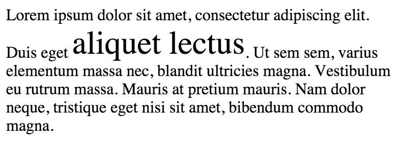

We can also align by `top` or `middle`.  However we align the span, the browser will make room above or below the rest of the affected line of text to accomodate the larger font.  We also see similar behavior if the span had a different `line-height`.

In our original example with the image, there were no descenders, so it aligned the bottom of the image on the baseline and only had to make room above the text.  A vertical alignment of `bottom` would have the same result, since the bottom and the baseline of an image are the same.  A vertical alignment of `top` would align the top of the image with the top of the text, making room below the text to accomodate the extra space.

## Inline vs Block-level elements

This behavior belongs to **inline** elements.  Inline elements flow inline with the text of the page, almost as if they themselves are text (and usually, they are).  By default, the following elements are inline:

 * span
 * a
 * b, i, strong, em
 * img
 * br
 * sub, sup
 * label
 * code
 * cite, abbr, acronym

On the other hand, most other elements are **block-level** elements.  Let's see what happens when we put a block-level element in the middle of our text:

```html
Lorem ipsum dolor sit amet, consectetur adipiscing elit. Duis
eget <div class="block-example">aliquet lectum.</div>  Ut
sem sem, varius elementum massa nec, blandit ultricies magna.
Vestibulum eu rutrum massa. Mauris at pretium mauris. Nam
dolor neque, tristique eget nisi sit amet, bibendum commodo
magna.
```

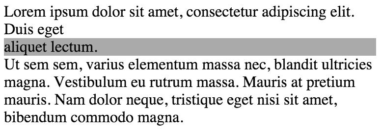

A block-level element appears on its own line, with a newline started both before and after.  By default, it fills the width of its container.  We can change the size of a block-level element using `height` and `width`, but it will still remain on its own line:

```css
.block-example {
  height: 3em;
  width: 50%;
}
```

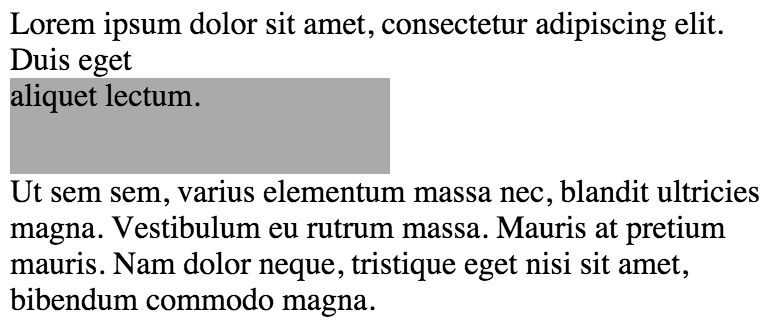

Because a block-level element is always on its own line, setting the `vertical-align` property on one has no effect.  Correspondingly, setting `height` or `width` on an inline element has no effect.

As we start nesting elements in the page, a block-level element can be used to constrain the bounds of its descendant elements:

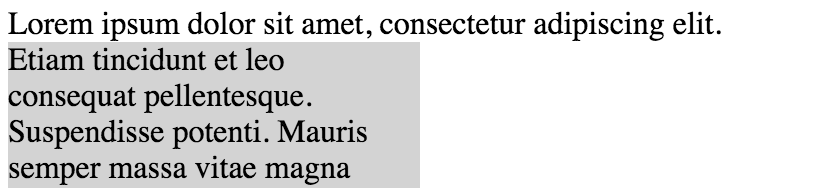

In this example, I have given the `<div>` a width of 50%, constraining document flow within.  I could also give the element a padding, further constraining the width of the inner content.  When we talk about the "container" of an element, we typically mean the nearest block-level ancestor.  The content inside our block here follows normal document flow, but it is constrained to the container's size.

## Floats

The normal document flow is limiting.  Sometimes we want our text on one side of the screen and a block-level element beside it.  Sometimes we want more than one block-level element beside one another.  One way we can accomplish this is with **floats**.

Before we start building any fancy layouts with floats, we need to understand what they are, and exactly how they behave.  Countless developers have seen that floats are the most common tool for laying out webpages, and started using them, only to find themselves helpless down the road when things don't behave like they expect.

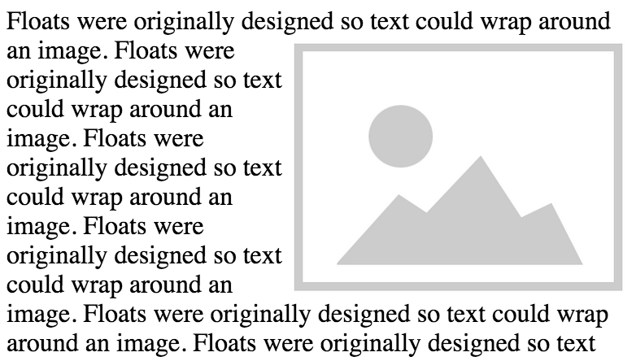

We can float an element in either direction: `float: left` or `float: right`.  This takes the element out of the document flow and shifts it to the edge of the current line of text.  If the element is inline, it is changed to be block-level.  Now in its new location, a space is carved out of the normal document flow where the element is, so content will not overlap with the floated element.

If we float multiple elements, they will stack up alongside one another.  Here are two elements floated left:


If we were to put all of our content into two containers, we could float both containers and set their sizes appropriately to create a two-column layout for our page.  Go ahead and try this yourself.  We will look at an example of this in depth in the next chapter.

## The Display Property

Floating implicitly changes inline elements to be block-level, but sometimes we want to do this explicitly.  We can do this with the `display` property:

```css
.inline {
  display: inline;
}
.block {
  display: block;
}
```

Typically, you should use a `<span>` when you need a generic inline element, and `<div>` when you need a generic block-level element.  With meaningful elements, we can't just swap for another, so we can use this to change their layout.

A few chapters ago, we created a horizontal nav menu with a series of buttons.  At the time, we just used anchors in a `<p>` tag, but now that we know how to change the `display` property, we can use a different element, and explicitly change its display to `inline` so the links align horizontally.  Since we want to show a list of links, the most symantically correct element is an unordered list.  Let's rework the markup a bit to use `<li>`s for each button:

```html
<ul class="nav">
  <li><a href="/">Home</a></li>
  <li><a href="/widgets">Widgets</a></li>
  <li><a href="/about">About</a></li>
  <li><a href="/special" class="nav-featured">Special</a></li>
</ul>
```

...and the css:

```css
.nav {
  padding-left: 0; /* override browser default */
  list-style: none; /* remove list bullets */
}

.nav li {
  display: inline;
}

.nav a {
  color: #fff;
  background-color: hsl(210, 60%, 40%);
  padding: .3em .5em;
  border-radius: .4em;
  text-decoration: none;
}

.nav .nav-featured {
  background: hsl(30, 80%, 50%);
}
```

You may notice I put the colors and padding on the `<a>` tag inside the `<li>`.  I like to do that, because the anchor tag is the what the user must click to trigger the link.  If, instead, we put the padding and background color on the `<li>`, there would be an area around the `<a>` that looks like a button but does not behave like one.  This way, the `<a>` fills up the entire volume of the `<li>`, and is in fact is what determines the size of the `<li>`.

I also made a few other updates based on things we've learned.  I changed to hex and HSL colors, as well as em units on the padding and border-radius.


The result here looks very much like before, but we are now using more symantically correct markup and we have the added bonus that the padding and border radius will scale with the font size if the user changes that.

### Hiding an element

The `display` property has other values as well.  An important one is `none`, which will hide an element completely, removing it from the document flow.  This is useful for elements you want to show and hide with JavaScript, by toggling this value.  But you don't always need JavaScript to get your desired behavior like this.  We can show and hide an element by selecting on the `:hover` state of its parent.  Let's try this out by creating a dropdown menu.

Let's create a container and give it the class "dropdown".  It will have two children.  The first, "dropdown-label" will be the portion that is always visible, which we can hover over.  The second, the "dropdown-menu" will be portion that we will show and hide.

```html
<div class="dropdown">
  <div class="dropdown-label">Menu</div>
  <ul class="dropdown-menu">
    <li><a href="/one">One</a></li>
    <li><a href="/two">Two</a></li>
    <li><a href="/three">Three</a></li>
  </ul>
</div>
```

```css
.dropdown {
  border: 1px solid #666;
  width: 10em;
}

.dropdown-menu {
  display: none;

  /* override the browser's default list styles: */
  padding-left: 0;
  margin: 0;
  list-style: none;
}

.dropdown:hover .dropdown-menu {
  display: block;
}
```

Now the "dropdown-menu" is hidden by default, but it's `display` value will change when the container is moused over.  Let's see how it looks:


...and when we mouse over:

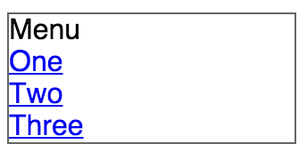

It works!  It's far from perfect, though.  If we want to select an item from the menu, we have to hover directly over the text of the link.  The links are inline elements, so they take up as much space as the text needs.  That's easy enough to change, with `display: block`.  And while we're in there, let's a little padding and some colors.

```css
.dropdown-menu a {
    display: block;
    padding: .3em;
    border-top: 1px solid #666;
    color: #333;
    background: #eee;
    text-decoration: none; /* remove link underline */
}
.dropdown-label {
  padding: .3em;
}
```

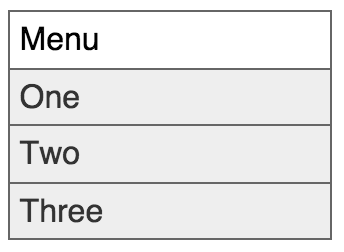

That's better.  Now the links are block-level, so they fill the width of the menu.  The addition of a border between each makes it especially clear to the user where they can click to select an item.  It still feels a little flat, so I'll add a hover state to each list item as well.  Here's the final css:

```css
.dropdown {
    border: 1px solid #666;
    width: 10em;
}

.dropdown-label {
    padding: .3em;
}

.dropdown-menu {
    display: none; /* hidden by default */
    padding-left: 0;
    margin: 0; /* override browser default top/bottom margin */
    list-style: none;
}

.dropdown:hover .dropdown-menu {
    display: block; /* show the menu when hovering */
}

.dropdown-menu a {
    display: block;
    padding: .3em;
    border-top: 1px solid #666;
    background: #eee;
    color: #333;
    text-decoration: none;
}

.dropdown-menu a:hover {
    color: #fff;
    background-color: hsl(200, 50%, 50%);
}
```

And the result, while the cursor hovers over the first item:

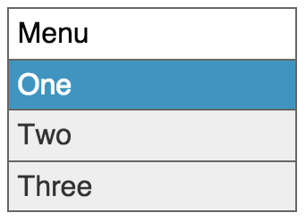

There is a fair bit of styling here that I slipped in here to make things look nice.  Don't worry too much about that yet, as we will walk through that more in later chapters.  For now, just make sure you understand why we put the three `display` declarations where we did.  You can remove every other declaration but those three, and still have a functional dropdown menu (try it!).

There is still one problem with this menu.  It looks fine on its own, but as soon as we add more content below it, that content will shift up and down on the screen as we open and close the menu.  This is because we're adding and removing the menu to the document flow when we toggle its `display` value.  We need to be able to show and hide it, without adding it into the document flow.  We can do this with the `position` property, but that is a can of worms for another chapter.

### Inline-block

Another important display value is `inline-block`.  This makes an element into a sort of hybrid between inline and block-level.  The element will flow inline and its vertical-alignment can be set like an inline element, but you can also set its height and width like a block-level element.

A handful of elements are inline block by default, mostly the form fields&mdash;`input`, `select`, `textarea`, and `button`&mdash;but this varies between browsers.  If you want to specify a height and width for one of these, it's best to explicitly set `display: inline-block` to ensure a consistant appearance in all browsers.  The `` tag is similar.  Some browsers indicate that it is inline, but it behaves effectively like an inline block.

Most of these elements are known as "replaced elements", because the browser represents them with special rules outside the scope of CSS.  With no styles applied, they have a very particular appearance.  An `` is replaced with a downloaded image, and the form fields vary depending on the browser and operating system.  Certain parts of these replaced elements can be styled using CSS, and some cannot.  The size and vertical alignment can be styled, however, so you can generally think of them as inline-block elements.

Inline block elements are an alternative to floats for creating multi-column layouts.  Floats come with a lot of complexity, so some developers were glad when browsers began implementing `inline-block`.

```css
.left,
.right {
    display: inline-block;
    vertical-align: top;
}
.left {
    width: 30%;
    background-color: #eee;
}
.right {
    width: 50%;
    background-color: #ccc;
}
```

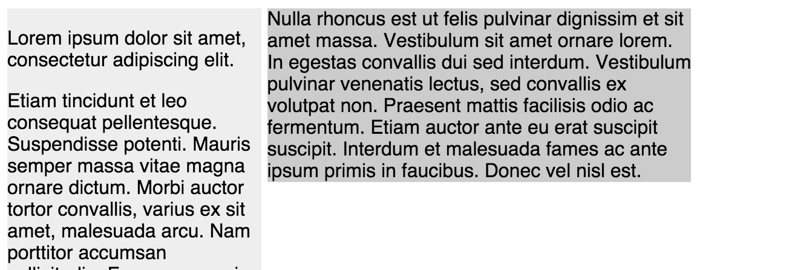

Just be aware that, because they flow inline with the text, any white space between inline-block elements is treated the same as between inline elements; it collapses to a single space.  You can see this gap in the screenshot above.  That means if two inline-block elements add up to 100% width, they will typically only fit on the same line if there is no white space between them.  Often, HTML is formatted with line breaks and indentation, so this will render as a space character.

It is for this reason that I generally do not use `inline-block` for laying out precise columns unless it is the only option for a particular design need.  I will show you three workarounds for this spacing issue, but I think every one of them is bad practice.

The first fix is to remove the whitespace where it is unwanted, including newlines, beginning one element immediately following the other:

```html
<div class="left">
  ...
</div><div class="right">
  ...
</div>
```

The second fix is similar.  You can fill this space with an HTML comment, making sure that the comment begins and ends immediately after one element and before the next with no white space:

```html
<div class="container">
  <div class="left">
    ...
  </div><!--
  --><div class="right">
    ...
  </div>
</div>
```

I do not like either of these options because they tightly couple the HTML to the CSS.  When you are editing the HTML, you have to be aware of how the CSS is doing its layout and you have to be careful to maintain these particular white space restrictions.  This is a violation of the principle of **encapsulation**.  The HTML should not have to know about the inner-workings of the CSS, but in order to enact either of these fixes, it must.

A third option is to set the text-size to zero on the containing element and then re-set it to the desired size on the inline-block elements.

```css
.container {
  font-size: 0;
}
.left,
.right {
  font-size: 1rem;
}
```

This only works if you ensure that the specified inline-block elements are the only children of the container.  This too is a violation of encapsulation.  Furthermore, it also means you cannot use ems or percent for the font size of the child elements, since any em value would be multiplied by zero, resulting in zero.

All three of these approaches are fragile for various reasons.  Using inline-block for multi-column layouts is tempting, but I think it should be a last resort if you cannot use floats or `display: table` to accomplish what you need.

It is much more useful in cases where you don't need to fill the container width exactly.  Then you can allow the whitespace to flow naturally, and let items line wrap wherever they fall.

### Table

You can also use the `display` property to make elements layout like an HTML table, using the values `table`, `table-row`, or `table-cell`.  A table or table-row element, like a block-level element, will fill the width of its container.  A series of table-cells will spread out to fill the width of their container.  Even though an HTML table requires `<table>`, `<tr>`, and `<td>` elements, you don't necessarily need to nest equivelent elements in this same structure when using CSS table layouts.  I often just need a series of `table-cells` inside of one `table`, with no `table-row` in between them in the hierarchy:

```css
.container {
  display: table;
}
.item {
  display: table-cell;
}
```

You can specify the cell widths directly, or allow the browser to size them dynamically based on how much content is in each.  If you want to ensure that they are each the same width, you can do that by setting two more properties on the container:

```css
.container {
  display: table;
  width: 100%; /* set a width (any works) */
  table-layout: fixed;
}
```

There are also a series of other table display values.  I have never had a need to use them, but for the sake of completeness, here they are:

 * `inline-table`: Similar to `table`, but behaves like `inline-block` instead of block-level
 * `table-caption`: Behaves like a `<caption>` element
 * `table-column`: Behaves like a `<col>` element
 * `table-column-group`: Behaves like a `<colgroup>` element
 * `table-header-group`: Behaves like a `<thead>` element
 * `table-row-group`: Behaves like a `<tbody>` element
 * `table-footer-group`: Behaves like a `<tfoot>` element

Now, unless you are fairly new to web development circles, you have surely heard that it is a bad practice to use HTML tables for layout.  Many websites into the early 2000s laid out their sites using `<table>`.  It can be much simpler to lay out many designs using tables instead of fighting with floats (which was the only other viable alternative at the time).  Eventually there was a lot of backlash against the use of tables for layout, because doing so meant using unsemantic HTML.  Instead of the HTML tags representing what content they contained, they were simply doing the work of layout&mdash;something CSS should be responsible for.

Browsers now support table display for elements other than `<table>`, so we can now enjoy the benefits of table layout while maintaining semantic markup.  It is not a "holy grail" solution, however.  There is also no equivalent to the HTML table attributes "colspan" and "rowspan".  There are also still things floats and inline-block can do that this cannot.
