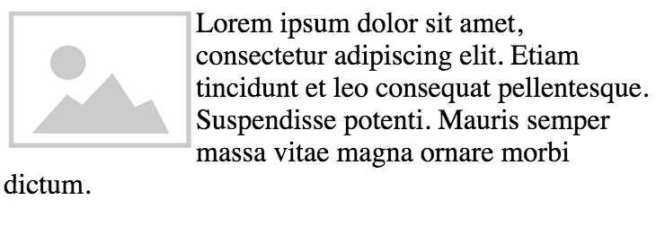

# Taming CSS
# Chapter 6: The Box Model

Let's take a closer look at a two-column layout.  We saw a few options in the last chapter for how we can approach this.  I'm going to choose to use floats.  I'll use the HTML5 elements `<nav>` and `<main>` to indicate the semantic purpose of each column, and give each a class to target with my CSS selectors.  I want them to fill the width of the page, so I'll designate their widths in percent, adding up to a total of 100%.

```html
<nav class="sidebar">
  Site navigation will go here.
</nav>
<main class="main">
  <h1>Page Title</h1>
  <p>Lorem ipsum dolor sit amet...</p>
</main>
```

```css
.sidebar {
  float: left;
  width: 30%;
}
.main {
  float: left;
  width: 70%;
}
```



Now we have two columns.  The `<h1>` has a top and bottom margin, which is what accounts for all that space around it.  It looks a little funny having the navigation content up so high, but the title in the main column down low, so we'll want to fix that.  And while we're thinking about space, the content of our two columns butts up right next to each other.  Let's apply some padding to even things out.  We'll give the sidebar some top padding to line up more evenly with our heading on the right, and we'll give both columns some padding on the left and right.

```css
.sidebar {
  float: left;
  width: 30%;
  padding: 1.333em 1em;
}
.main {
  float: left;
  width: 70%;
  padding: 0 1em;
}
```


Hey, what happened to our columns?  We did not change the `width`.  30% plus 70% should equal 100%, but for some reason, our columns are too wide.  If we bring one of them down a few percent, they suddenly fit side by side again.  The reason for this lies in the CSS **box model**.


<!--
width problem (w/ floats)
element size (based on children, etc.)
height/width, min-*, max-*
margin collapsing
overflow
negative margins
-->
