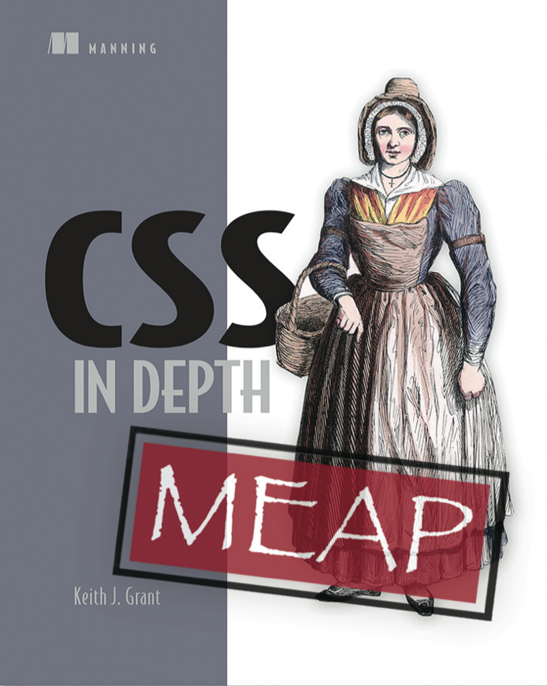

# CSS in Action

 **Update**: *I'm excited to announce that I have signed with Manning Publications. “Taming CSS” is now “CSS in Action”. I am keeping the early drafts of these first chapters here for now, but be aware that these are rough; they have come a long way since. As of 7 December 2015, the book is about 1/3 draft complete, and the [MEAP](https://www.manning.com/meap-catalog) should be available soon.*

 *This does mean that further updates to the manuscript will not be available here on GitHub. For that, I am sorry. But after consideration, I have decided that working with the publisher will help me to produce a much higher-quality book in the end, and hopefully enable the book to reach a larger audience.*

 Follow [@css_in_action](http://twitter.com/css_in_action) on Twitter for updates.

 This is a book taking a comprehensive look at how to write and maintain CSS.  It is written primarily for web developers, but I start with the basics so anybody should be able to pick up and follow along. For more on why I am writing it and what sets it apart from other CSS books out there, I invite you to read the [Introduction](introduction.md).

## Initial drafts
These are not the newest versions of these chapters; these are **very rough** drafts as I've had them here on GitHub. Note the chapter numbers don't align with the current Table of Contents.

* [Introduction](introduction.md)
* [Getting Started](Crawling/chapter1.md)
* [Styling Essentials](Crawling/chapter2.md)
* [Cascade, Specificity, & Inheritance](Crawling/chapter3.md)
* [Data Types & Units](Crawling/chapter4.md)
* [Document Flow](Crawling/chapter5.md)

## Table of Contents
**Part I: Fundamentals**
<ol>
  <li>Cascading style sheets</li>
  <li>Getting started</li>
  <li>Styling Essentials</li>
  <li>Cascade, specificity, and inheritance</li>
  <li>Data types and units</li>
  <li>Document flow</li>
  <li>The box model and element sizing</li>
  <li>Development workflow</li>
  <li>Cross-browser development</li>
</ol>

**Part II: Going deeper**
<ol start="10">
  <li>Advanced selectors</li>
  <li>Organization methodology</li>
  <li>Floats</li>
  <li>Flexbox</li>
  <li>The position property</li>
  <li>Pseudo-elements</li>
  <li>Lists</li>
  <li>Backgrounds</li>
  <li>Forms</li>
  <li>Preprocessors</li>
  <li>Responsive design</li>
</ol>

**Part III: From good to great**
<ol start="21">
  <li>Transitions</li>
  <li>Animations and transformations</li>
  <li>Performance</li>
  <li>Color</li>
  <li>Typography</li>
  <li>Building a cohesive user experience</li>
  <li>What next?</li>
</ol>

Mind the overhead bins. Chapters may shift during flight.

## Contributing

I welcome feedback. It is still a work in progress, and I want to make it as helpful as possible. There will be a forum for feedback & suggestions on manning.com as soon as the MEAP is available. I will update this page with more information when available.

## License & Copyright

These drafts were initially published here under <a rel="license" href="http://creativecommons.org/licenses/by-nc-nd/4.0/">Creative Commons Attribution-NonCommercial-NoDerivatives 4.0 International License</a>. This obviously will not extend to the final published version of the book.
